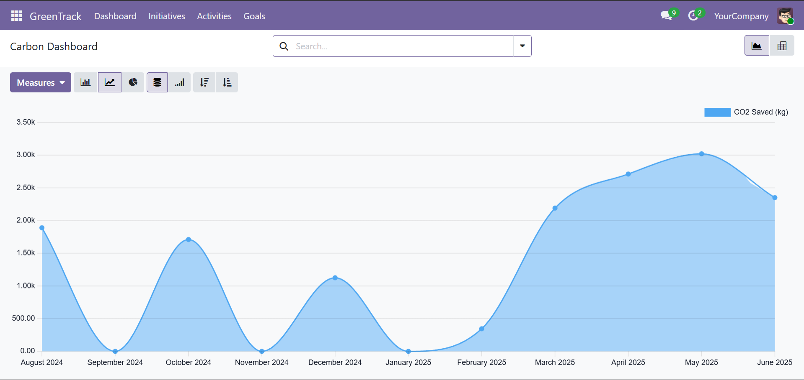

# 🌱 GreenTrack - Carbon Intelligence Platform

> **AI-Powered Carbon Management for UAE Enterprises Aligned with Net Zero 2050**

An innovative Odoo-based sustainability platform that empowers UAE organizations to track, manage, and reduce their carbon footprint through intelligent monitoring, predictive analytics, and gamified goal achievement.

---

## 📸 Screenshots

### Dashboard - CO2 Savings Trend

*Real-time visualization of carbon savings over time with interactive analytics*

### Activities Management

*Track all carbon-generating and carbon-saving activities with detailed metrics*

### Goals & Achievement Tracking

*Monitor progress toward sustainability milestones with visual indicators*

### Odoo Interface

*Built on the powerful Odoo 19 platform for seamless integration and scalability*

---

## 🎯 Overview

GreenTrack is a comprehensive Carbon Intelligence Platform built on Odoo 19 that helps UAE organizations plan, manage, and measure the impact of their CSR and sustainability initiatives. Aligned with UAE's Net Zero 2050 strategy and UN Sustainable Development Goals, GreenTrack transforms sustainability management from reactive reporting to proactive decision-making.

### 🌟 Key Highlights

- **Real-time Carbon Tracking**: Monitor emissions and reductions across energy, transport, waste, water, and office operations
- **AI/ML Predictions**: Forecast future emissions using statistical analysis and linear regression
- **Interactive Dashboards**: Visualize environmental impact through charts, graphs, and pivot tables
- **Gamification**: Set goals, track achievements, and celebrate milestones
- **UAE-Specific**: Built with UAE emission factors and aligned with local sustainability initiatives
- **Comprehensive Reporting**: Generate insights for CSR compliance and stakeholder reporting

---

## ✨ Core Features

### 1. 📊 Carbon Initiatives Management

Manage environmental programs and sustainability projects:
- **Categories**: Energy Efficiency, Waste Reduction, Sustainable Transport, Green Office, Water Conservation
- **Lifecycle Tracking**: Draft → Active → Completed/Cancelled
- **Target Setting**: Define CO2 reduction goals with deadline tracking
- **Progress Monitoring**: Real-time calculation of actual vs. target achievements
- **AI Predictions**: 
  - Next month CO2 forecast based on historical data
  - Trend analysis (improving/stable/declining)
  - Top activity type identification
  - Confidence scoring for predictions

### 2. 🎬 Carbon Activities Tracking

Log individual emission and reduction events:
- **Activity Types**:
  - ⚡ Electricity Usage
  - 🚗 Fuel Consumption
  - 📄 Paper Usage
  - 🚙 Travel (Car/Transport)
  - 🗑️ Waste Generated
  - 💧 Water Usage
- **Dual Intent**:
  - **Emission Tracking**: Monitor regular carbon-generating activities
  - **Reduction Activities**: Record carbon savings from initiatives
- **Automatic Calculations**: CO2 impact computed using UAE-standard emission factors
- **Static Emission Factors**:
  - Electricity: 0.45 kg CO2/kWh (UAE Grid Average)
  - Fuel: 2.31 kg CO2/liter (Gasoline)
  - Paper: 0.01 kg CO2/sheet
  - Travel: 0.12 kg CO2/km
  - Waste: 0.5 kg CO2/kg
  - Water: 0.0003 kg CO2/liter

### 3. 🎯 Carbon Goals & Milestones

Set and track sustainability targets:
- **Goal Types**: Reduction targets and milestone achievements
- **Smart Status Management**:
  - 🟡 **Pending**: No progress yet
  - 🔵 **In Progress**: Working toward target
  - 🟢 **Achieved**: Target met (≥100%)
  - 🔴 **Missed**: Deadline passed without achievement
- **Environmental Impact Display**:
  - Trees planted equivalent
  - Cars off the road equivalent
- **Automatic Progress Calculation**: Based on linked initiative activities

### 4. 📈 Interactive Dashboards

Visualize sustainability performance:
- **Line Charts**: CO2 savings trends over time
- **Bar Charts**: Emissions by activity type and category
- **Pie Charts**: Distribution of carbon savings
- **Pivot Tables**: Multi-dimensional analysis with drill-down capabilities
- **Activity Analytics**: Filter and analyze by date, type, initiative, and employee
- **Initiative Performance**: Compare targets vs. actuals across programs
- **Goal Achievement**: Track milestone progress with visual indicators

### 5. 🤖 AI-Powered Predictions

Make data-driven decisions with predictive analytics:
- **Linear Regression Analysis**: Forecast future CO2 savings (no external dependencies)
- **Trend Detection**: Identify improving, stable, or declining performance
- **Top Contributors**: Highlight which activities drive the most impact
- **Confidence Scoring**: Understand prediction reliability (0-100%)
- **Historical Analysis**: Use 6-month rolling window for accurate forecasts
- **Automatic Updates**: Predictions recompute when new activities are logged

### 6. 👥 Collaboration Features

Built on Odoo's powerful collaboration framework:
- **Activity Tracking**: Mail integration for communication
- **Employee Attribution**: Track who logged each activity
- **Initiative Ownership**: Assign responsibility for programs
- **Chatter Integration**: Discuss activities and initiatives in context
- **Notification System**: Stay informed of important updates

---

## 🏗️ Technical Architecture

### Technology Stack

- **Framework**: Odoo 19.0 (Python-based ERP)
- **Database**: PostgreSQL 16
- **Frontend**: Odoo Web Framework (XML views, JavaScript)
- **Containerization**: Docker & Docker Compose
- **AI/ML**: Custom prediction engine using statistical analysis (pure Python - no numpy)

### Module Structure

```
greentrack_carbon/
├── models/                      # Business logic
│   ├── carbon_initiative.py    # Environmental programs
│   ├── carbon_activity.py      # Emission/reduction events
│   ├── carbon_goal.py          # Targets and milestones
│   └── carbon_prediction.py    # AI prediction engine
├── views/                       # User interface
│   ├── carbon_initiative_views.xml
│   ├── carbon_activity_views.xml
│   ├── carbon_goal_views.xml
│   ├── dashboard_views.xml     # Analytics dashboards
│   └── menu.xml                # Navigation structure
├── data/
│   └── demo_data.xml           # Sample data
├── security/
│   └── ir.model.access.csv     # Access rights
└── __manifest__.py             # Module configuration
```

### Key Models

1. **carbon.initiative** - Environmental programs with AI predictions
2. **carbon.activity** - Individual tracking events with auto-calculations
3. **carbon.goal** - Targets with automatic status management
4. **carbon.prediction** (Abstract) - Prediction engine service

---

## 💼 Benefits

### For Organizations
- ✅ **Compliance**: Meet UAE Net Zero 2050 and CSR reporting requirements
- ✅ **Cost Savings**: Identify high-impact areas for operational efficiency
- ✅ **Reputation**: Demonstrate environmental commitment to stakeholders
- ✅ **Data-Driven**: Make informed decisions based on predictive analytics
- ✅ **Scalability**: Track multiple initiatives across departments and locations

### For Employees
- ✅ **Engagement**: Gamified goals create motivation and competition
- ✅ **Visibility**: See individual contributions to organizational sustainability
- ✅ **Simplicity**: Easy-to-use interface for logging activities
- ✅ **Recognition**: Track and celebrate environmental achievements

### For Sustainability Teams
- ✅ **Centralization**: Single platform for all carbon management
- ✅ **Analytics**: Comprehensive reporting and insights
- ✅ **Automation**: Automatic calculations and progress tracking
- ✅ **Forecasting**: Predict future performance and plan accordingly
- ✅ **Benchmarking**: Compare initiatives and identify best practices

---

## 🚀 Getting Started

### Prerequisites

- **Docker Desktop** (for Windows/Mac) or Docker Engine (for Linux)
- **Git** (to clone the repository)
- 4GB RAM minimum, 8GB recommended
- 10GB free disk space

### Installation & Setup

1. **Clone the repository**
   ```bash
   git clone https://github.com/amanriyas/odoo-hackathon.git
   cd odoo-hackathon
   ```

2. **Start Docker Desktop**
   - Ensure Docker Desktop is running (Windows/Mac)
   - Wait for the whale icon to be steady in system tray

3. **Launch the application**
   ```bash
   docker compose up -d
   ```
   This will:
   - Pull Odoo 19.0 and PostgreSQL 16 images
   - Create and configure containers
   - Initialize the database
   - Load demo data automatically

4. **Wait for initialization** (~30-60 seconds)
   - First-time setup takes longer to download images
   - Check status: `docker compose ps`
   - View logs: `docker compose logs -f odoo`

5. **Access the application**
   - Open browser to: **http://localhost:8069**
   - **Database**: odoo
   - **Email**: admin
   - **Password**: admin

6. **Navigate to GreenTrack**
   - Look for "GreenTrack" in the app menu (purple icon)
   - Explore Initiatives, Activities, Goals, and Dashboards

### Stopping the Application

```bash
# Stop containers (keeps data)
docker compose stop

# Stop and remove containers + volumes (fresh start)
docker compose down -v

# Restart
docker compose up -d
```

### Accessing Demo Data

The application comes pre-loaded with comprehensive demo data:
- **7 Initiatives**: Active, completed, and draft programs
- **30+ Activities**: Spanning 8 months with varied types
- **7 Goals**: Different states (achieved, in progress, missed)

---

## 📱 Usage Guide

### Creating a New Initiative

1. Navigate to **GreenTrack → Initiatives → New**
2. Fill in details:
   - Name (e.g., "Solar Panel Installation 2025")
   - Category (Energy, Waste, Transport, etc.)
   - Start/End dates
   - Target CO2 reduction (kg)
3. Set status: Draft → Active
4. Save

### Logging Carbon Activities

1. Go to **GreenTrack → Activities → New**
2. Select:
   - **Activity Type** (electricity, fuel, paper, etc.)
   - **Intent**: Emission (tracking) or Reduction (savings)
   - **Quantity** and **Unit**
   - **Date**
   - **Initiative** (optional link)
3. Emission factor auto-fills based on UAE standards
4. CO2 is automatically calculated
5. Save

### Setting Goals

1. Navigate to **GreenTrack → Goals → New**
2. Define:
   - Goal name and description
   - Target CO2 reduction (kg)
   - Target date
   - Linked initiative
3. Status automatically updates based on progress
4. View environmental impact equivalents

### Viewing Dashboards

1. **Dashboard → Activity Analytics**: See CO2 trends over time
2. **Dashboard → Initiative Performance**: Compare program effectiveness
3. **Dashboard → Goal Achievement**: Monitor milestone progress
4. Use chart controls to switch between line, bar, pie, and pivot views
5. Apply filters to analyze specific time periods or categories

---

## 🎓 Use Cases

### 1. Corporate Sustainability Office
Track company-wide initiatives like:
- Solar panel installations
- EV fleet transitions
- Paperless transformations
- Waste reduction programs

### 2. Facility Management
Monitor building operations:
- Energy consumption tracking
- Water usage optimization
- HVAC efficiency improvements
- LED lighting retrofits

### 3. CSR Departments
Report on sustainability efforts:
- Generate compliance reports
- Demonstrate environmental commitment
- Track progress toward Net Zero goals
- Communicate impact to stakeholders

### 4. Employee Engagement
Gamify sustainability:
- Department competitions
- Individual carbon savings tracking
- Achievement recognition
- Environmental challenges

---

## 🔧 Configuration

### Emission Factors

Emission factors are defined in `models/carbon_activity.py`:
```python
EMISSION_FACTORS = {
    'electricity': 0.45,  # kg CO2 per kWh (UAE Grid Average)
    'fuel': 2.31,         # kg CO2 per liter (Gasoline - EPA Standard)
    'paper': 0.01,        # kg CO2 per sheet (Industry Average)
    'travel': 0.12,       # kg CO2 per km (Average Sedan)
    'waste': 0.5,         # kg CO2 per kg (Landfill Average)
    'water': 0.0003,      # kg CO2 per liter (Treatment Process)
}
```

Customize these values based on your region or industry-specific data.

### Docker Configuration

Modify `docker-compose.yml` to:
- Change database credentials
- Adjust ports
- Add custom addons paths
- Configure resource limits

---

## 🤝 Contributing

We welcome contributions! To contribute:

1. Fork the repository
2. Create a feature branch: `git checkout -b feature/new-feature`
3. Commit changes: `git commit -m 'Add new feature'`
4. Push to branch: `git push origin feature/new-feature`
5. Submit a pull request

### Development Setup

```bash
# Clone your fork
git clone https://github.com/YOUR_USERNAME/odoo-hackathon.git

# Create feature branch
git checkout -b feature/your-feature

# Make changes and test
docker compose down -v
docker compose up -d

# Commit and push
git add .
git commit -m "Description of changes"
git push origin feature/your-feature
```

---

## 📄 License

This project is licensed under LGPL-3 - see the module manifest for details.

---

## 🙏 Acknowledgments

- Built with [Odoo 19.0](https://www.odoo.com/)
- Inspired by UAE Net Zero 2050 initiative
- Emission factors based on EPA and UAE standards
- Developed for Odoo Hackathon

---

## 📞 Support

For issues, questions, or feature requests:
- Open an issue on [GitHub Issues](https://github.com/amanriyas/odoo-hackathon/issues)
- Refer to [Odoo Documentation](https://www.odoo.com/documentation/19.0/)

---

## 🔮 Future Enhancements

- 🌐 External API integration for real-time emission factors (Climatiq, Carbon Interface)
- 📱 Mobile app for activity logging
- 🤖 Advanced ML models (Prophet, LSTM) for forecasting
- 📊 Enhanced reporting templates (PDF exports)
- 🌍 Multi-language support (Arabic, English)
- 🏆 Employee leaderboards and badges
- 📧 Automated email notifications for goal achievements
- 🔗 Integration with IoT sensors for automatic data collection
- 📈 Benchmarking against industry standards
- 🎯 Carbon offset marketplace integration

---

<div align="center">

**🌱 Building a Sustainable Future, One Action at a Time 🌍**

Made with 💚 for the Planet

</div>
